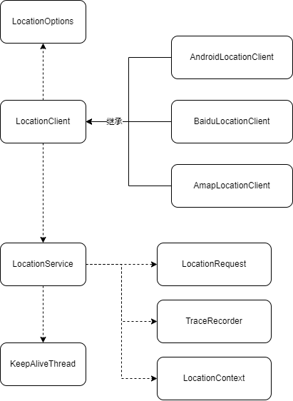

# MagicalLocation

Android 定位库，提供实时位置信息、轨迹记录功能，定位以后台服务方式进行持续定位并带后台保活方案。应用场景：

- 地图类APP，需要在任何代码位置中获取GPS位置信息，或者GPS定位图层。
- 运动类APP，需要实时更新当前位置信息以及后台轨迹记录的。

默认实现为Android系统定位，若需要百度或者高德地图实现可以自行实现`BaseLocationRequest`。



## 集成

```groovy

repositories {
    // 仓库地址
    maven { url 'https://maven.raeblog.com/repository/public/' }
}

dependencies {
    // 引用库
    implementation 'com.github.raedev:location:1.0.0'
}
```

## 使用

更多调用方式请查看`MainActivity.kt`示例。

```kotlin

// TODO：请自行先获取定位权限后再调用LocationClient，否则后面的服务都不可用。
val context: Activity = this
LocationPermission.requestPermission(context)

// 初始化位置客户端
val client = LocationClient(context)
client.listener = object : LocationListener {
    override fun onLocationChanged(location: Location) {
        // 位置信息回调（业务处理）
    }
}

// 开始监听位置信息
client.start()

// 获取最后一次位置信息
val location = MagicalLocationManager.getLastLocation(context)

// 停止位置监听
client.stop()

// 释放后台服务
client.destroy()

```